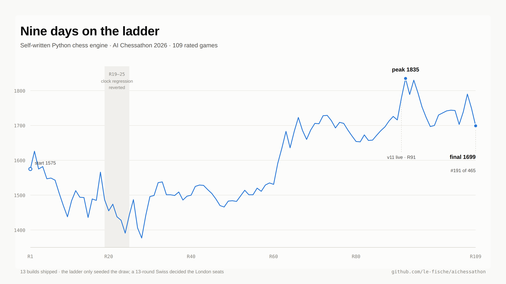
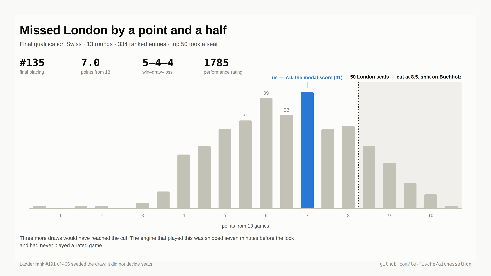
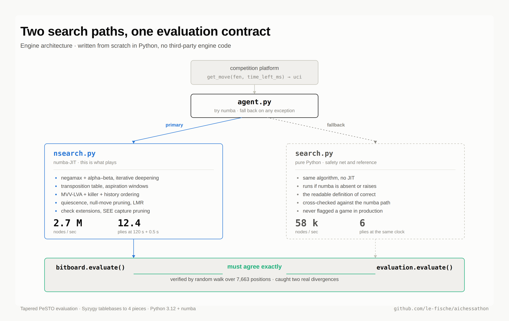
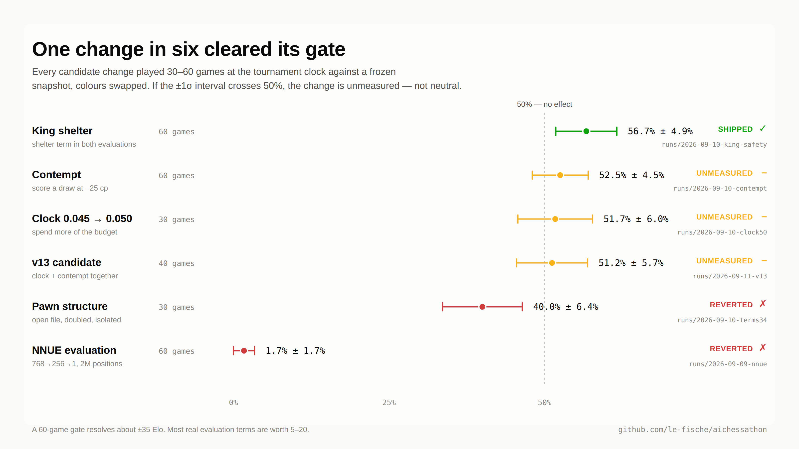
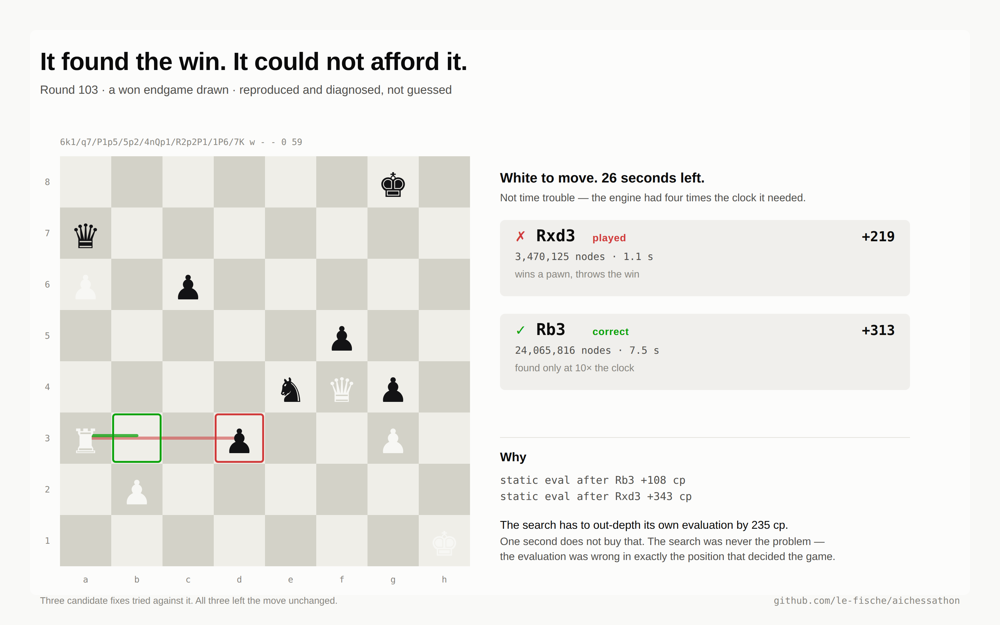

# aichessathon

A chess engine written from scratch in Python for the [AI Chessathon](https://aichessathon.com),
September 2026. No third-party engine code — the search, the evaluation and the move
generation are all ours.

**Result: 135th of 334 in the final qualification Swiss — 5–4–4 over 13 rounds, 7.0 points,
performance rating 1785.** The top 50 took a seat at the London final; the cut fell at 8.5.
On the seeding ladder: 191st of 465, peak rating 1835, final 1699 across 109 rated games.
That is mid-field, and [the post-mortem below](#post-mortem-why-it-finished-mid-field) says
why in more detail than is comfortable.

Built by [Houze Guo](https://github.com/le-fische) and
[Gede Danny Putra Budiada](https://github.com/dannybud19) over nine days, from a
standing start.

<picture>
  <source media="(prefers-color-scheme: dark)" srcset="docs/images/01-rating-trajectory-dark.png">
  
</picture>

The ladder above only seeded the draw. Seats were decided by a 13-round Swiss over builds
locked at the deadline:

<picture>
  <source media="(prefers-color-scheme: dark)" srcset="docs/images/05-final-swiss-dark.png">
  
</picture>

Worth one caveat against ourselves. The build that played that Swiss was finished seven
minutes before the lock and had never played a rated game — no gate, no evidence — and it
performed at 1785 against a ladder rating of 1699. It would be easy to read that as the
untested change working. It isn't: 13 games carries a standard error of roughly ±140 Elo,
which is the same measurement problem described below, just pointing in a flattering
direction for once.

---

## What it is

The competition takes a zip containing `agent.py`, which exposes
`get_move(fen, time_left_ms) -> str`, and plays it against other entrants on a fixed
cadence at 120 s + 0.5 s per move.

Thirteen builds shipped. The last one played the qualification Swiss.

```
agent.py        entry point. Tries the numba search, falls back to the Python
                search on any exception.
nsearch.py      numba-JIT search. This is what actually plays.
bitboard.py     numba move generation and evaluation. nsearch imports evaluate here.
search.py       pure-Python search. The fallback path, and the reference implementation.
evaluation.py   pure-Python evaluation. Must agree with bitboard.py exactly.
weights/        Syzygy tablebases, 4 pieces and under, plus the NNUE network.
tools/          measurement harnesses. run_gate_match.py is the one that decides things.
tests/          test_evaluate.py compares the two evaluations on 7,663 positions.
runs/           append-only record of every measurement, including the ones that
                contradicted us.
versions/       every shipped release, with a manifest recording the zip's sha256,
                the five source hashes, and what evidence it shipped on.
```

## How it plays

<picture>
  <source media="(prefers-color-scheme: dark)" srcset="docs/images/03-architecture-dark.png">
  
</picture>


**Search** — negamax with alpha-beta, iterative deepening, transposition table,
MVV-LVA capture ordering with killer and history heuristics, quiescence, null-move
pruning, late move reductions, aspiration windows, check extensions, and SEE for
losing-capture pruning. Roughly **2.7 M nodes/sec** and **12.4 plies** at the tournament
control, against the pure-Python fallback's 58 k nps and 6 plies.

**Evaluation** — tapered PeSTO piece-square tables interpolated over game phase, passed
pawns, king shelter, plus Syzygy tablebase probing for 4-piece endings. An NNUE
(768→256→1, trained in PyTorch, quantized to int16) exists and is wired in, but never
beat the classical evaluation in a gate.

**The invariant that caused the most trouble:** there are two evaluations. `nsearch.py`
imports `evaluate` from `bitboard.py`; everything else uses `evaluation.py`. A term added
to one and not the other passes every curated test and fails only a random-walk agreement
check over thousands of positions. That check caught two real divergences.

## How anything was decided

A change was not an improvement until a match said so. Every gate ran 30–60 games at the
real time control, colours swapped over paired openings, against a **frozen snapshot**
rebuilt from a git ref — never against the working tree — with the sha256 of all five
source files printed into the results file. `CHESSATHON_REQUIRE_NUMBA=1` turned the silent
numba fallback into a hard error, because without it a match can quietly measure the
Python search against itself. That happened once and produced a bogus result.

```bash
CHESSATHON_REQUIRE_NUMBA=1 uv run python tools/run_gate_match.py
```

Scores are reported as a percentage with a standard error. **If the interval crosses 50%,
the change is unmeasured, not neutral.** Everything in `runs/` follows that rule, including
where it went against us:

<picture>
  <source media="(prefers-color-scheme: dark)" srcset="docs/images/02-gate-results-dark.png">
  
</picture>

| Gate | Result | Verdict |
|---|---|---|
| King shelter, both evaluations | +22 =24 −14, **56.7% ± 4.9%** | shipped |
| Contempt (draw scored at −25 cp) | +16 =31 −13, 52.5% ± 4.5% | unmeasured, not shipped |
| Clock coefficient 0.045 → 0.050 | +7 =17 −6, 51.7% ± 6.0% | unmeasured, not shipped |
| v13 candidate (clock + contempt) | +11 =19 −10, 51.2% ± 5.7% | unmeasured, not shipped |
| Rook-on-open-file + doubled/isolated pawns | +5 =14 −11, **40.0% ± 6.4%** | regression, reverted |
| NNUE replacing the classical evaluation | +1 =0 −59, **1.7% ± 1.7%** | reverted |
| Depth-preferred TT replacement | −3.6% nodes, 95% CI −7.8%…+32.7% | no effect, not shipped |

One gate in seven shipped.

---

## Post-mortem: why it finished mid-field

### 1. The gate could not resolve the improvements we were looking for

This is the real answer, and it took until the last day to see it.

A 60-game gate has a standard error of about ±4.5% on the score. In Elo terms that is
roughly **±35 Elo**. A genuine evaluation term — a bishop pair bonus, a rook on the
seventh — is worth perhaps 5 to 20 Elo. So the instrument was, by construction, unable to
detect the thing it was built to detect. Almost everything landed in "unmeasured", and
"unmeasured" meant "don't ship".

Each of those gates took **four to six hours** of wall clock. Over nine days, that budget
buys on the order of thirty decisions, and most of them return no signal. The constraint
was never a shortage of ideas. It was that we could not tell the good ones from the bad
ones fast enough to compound them.

The fix, had there been time, is well known and we simply did not do it: fixed-depth or
fixed-node matches to cut variance, SPRT with early stopping instead of fixed-length runs,
and an opening book of balanced positions to reduce draw rates. That is a day of tooling
which would have paid for itself in three.

### 2. Effort went to evaluation; the evidence pointed at search

Measured effective branching factor in real games is **3.23** (299 plies, depths 11–15).
A well-ordered alpha-beta search sits at 2.0–2.5. Closing that gap is worth about
**+3 plies** — far more than any evaluation term on the table.

We ranked pruning first on paper and then spent most of the week on evaluation anyway,
because evaluation changes are easy to write and pruning changes are frightening. That was
the wrong call, made repeatedly.

Worth recording that an earlier version of this number was **wrong**: `bench_v11.py` passed
its `--ms` argument as the engine's remaining clock rather than as the search budget, so
"3-second" benchmarks actually ran 0.29–0.45 s, and EBF is inflated on a truncated search.
That produced a reported EBF of 4.64–7.01 and a claim of +6–8 plies available. Both were
artefacts. The corrected figure is in `runs/2026-09-10-v12/`.

### 3. The NNUE was tested, and it was badly undertrained

Danny trained a 768→256→1 network in PyTorch and gated it properly. It lost
**+1 =0 −59 — a 1.7% score over 60 games** against the classical evaluation. That is not a
marginal failure; it is the network being actively worse than the piece-square tables it
replaced.

The run record (`runs/2026-09-09-nnue/gate_results.txt`) says why:

```
Positions:          2,000,000
Epochs:             5
Stockfish Depth:    8
Weights SHA256:     0fa32920aa12fbaa...
```

Two million positions labelled at **depth 8** is a small, shallow dataset. Depth-8
evaluations are close to a quiescence score — they carry little of the positional judgement
the network is supposed to learn — and two million samples across five epochs is nowhere
near enough to fit 197 k parameters to something better than hand-tuned PSTs. Serious NNUE
training runs use orders of magnitude more data at greater depth, and iterate by relabelling
with the improved network.

For scale, [an entrant that qualified near the top](https://github.com/TahaKhanM/AIChessathon)
used a substantially larger evaluator: a
512-channel accumulator over piece-square, threat and pawn-pair features, 12 non-uniform
king buckets, and multiple hidden layers with auxiliary output heads, against our single
256-wide hidden layer. Their repository is public but deliberately withholds the dataset
and hyperparameters that produced the ranked checkpoint, so there is no honest numeric
comparison to draw — only the observation that the architecture is a different class of
thing, and that getting a network to beat a decent classical evaluation is much harder than
it looks from the outside.

Three separate bugs in the NNUE loader cost days of dev time and are worth recording, even
though `nsearch_nnue.py` never shipped in v11, v12 or v13 and so never affected a rated
game: weights loaded with `os.path.exists("weights.npy")`, a path relative to the working
directory while the files live in `weights/`, which silently yields an all-zero network;
inverted rook colours in all four castling branches of the accumulator update; and a
double-applied quantization scale — `out // 64 // 64` where the derivation gives
`out // 64`, since 87.538 = 64 · 173.72/127. Once fixed, the network correlated **+0.957**
with the classical evaluation, confirming the plumbing was finally right. The training was
still the problem.

### 4. The blunder theory was wrong, and measuring it said so

Going into the last stretch the working theory was that bad moves cluster at low clock, and
that better time management would fix the losses. Both halves turned out to be false.

558 of our moves across ten rated games, scored against Stockfish at depth 14:

```
                                 n   mean CPL   median   >=100cp
ALL MOVES                      558       21.7      0.0      5.0%
fastest quartile by time used  139       10.7      0.0      1.4%
slowest quartile by time used  139       31.2      8.0      9.4%
```

Mean centipawn loss of 21.7 is respectable — the engine is not throwing away material in
the general case. And the *slow* moves are the inaccurate ones, not the fast ones, because
difficulty drives both: hard positions attract more thinking time and produce more errors.
The causation runs backwards from the hypothesis.

Separately, across 23 games, **all four losses were checkmates** — none on time, none by
adjudication — and two of them ended with 28.5 s and 42.4 s still unspent. The problem was
never the clock.

Getting this right required one methodological correction worth recording: the first pass
did not clamp evaluations, so `mate_score=100000` turned a single forced mate into a CPL
near 98,000 and put the overall mean at 556.7 against a median of 1.0. Every mean was
garbage while every median was fine.

### 5. One position, diagnosed properly, showed the ceiling

<picture>
  <source media="(prefers-color-scheme: dark)" srcset="docs/images/04-round-103-dark.png">
  
</picture>

Round 103, a won endgame drawn. The engine played `Rxd3` where `Rb3` wins:

```
6k1/q7/P1p5/5p2/4nQp1/R2p2P1/1P6/7K w - - 0 59

v12 @ 26 s     Rxd3   +219    3,470,125 nodes
v12 @ 260 s    Rb3    +313   24,065,816 nodes
```

It **can** find the right move. It needs about seven times the nodes, because its own
evaluation scores the position after `Rb3` at +108 and after `Rxd3` at +343. `Rxd3` wins a
pawn, so the search has to out-depth its own evaluation by 235 cp, and one second does not
buy that.

That is the whole problem in one position: a decent search pointed at an evaluation that
is wrong in exactly the positions where games are decided. Three candidate fixes were
tried against it — cold TT, saturated TT, quiet checks in quiescence — and all three left
the move unchanged. Written up in [`tools/probe/FINDINGS.md`](tools/probe/FINDINGS.md).

### What went right

The methodology. Frozen snapshots with hash manifests, every measurement appended to
`runs/` whether or not it flattered us, and releases archived with the evidence they
shipped on. Several times that discipline caught something that a more optimistic process
would have shipped: the pawn-structure regression at 40.0%, the moves-to-go clock that cost
79 rating points in six rounds, and the eval divergence between the numba and Python paths.

Finishing mid-field with an engine that is honestly documented is a better outcome than
finishing fifty places higher with one whose numbers nobody can reproduce.

---

## Running it

```bash
uv sync
CHESSATHON_REQUIRE_NUMBA=1 uv run python -c "
import chess, nsearch
b = chess.Board()
print(nsearch.get_move_with_info(b, 120000, {})[0])
"
```

First call compiles the numba kernels and takes about 10 seconds. Tests:

```bash
uv run pytest tests/
```

Requires Python 3.12, `python-chess`, `numpy`, `numba`; `torch` only for NNUE training.

## Repository notes

- **Everything at the repo root ships.** `harness/package.py` globs every root `*.py` into
  the submission zip and includes `weights/` wholesale. Scratch scripts go in
  `tools/scratch/`, which is gitignored.
- `runs/` is append-only. Corrections are added as new entries; nothing is rewritten.
- Internal working docs — the handoff, the task relays, the session context — are in
  [`docs/`](docs/).

## Credits

Written by [Houze Guo](https://github.com/le-fische) and
[Gede Danny Putra Budiada](https://github.com/dannybud19).

Claude (Anthropic) was used throughout as a development assistant — code review,
measurement tooling, debugging, and drafting documentation including this README.
It did not get a vote: every change it proposed had to clear the same gate as any
other, and several of them are in the table above under "reverted".

MIT licensed.
